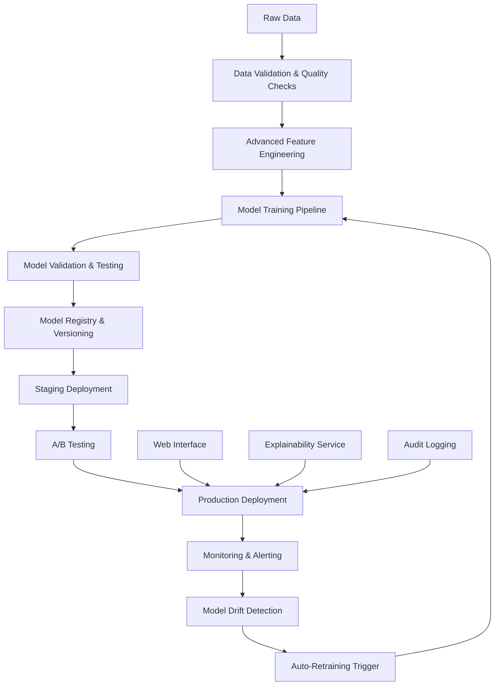

# Design Document

## Overview

This design enhances the existing debt collection ML system to achieve production-ready performance with improved accuracy, comprehensive MLOps integration, and enterprise-grade monitoring. The system will leverage the current DVC + DagsHub foundation while adding advanced feature engineering, model optimization, deployment automation, and explainability components.

## Architecture

### High-Level Architecture



### Technology Stack Enhancement

- **Existing**: DVC, DagsHub, Python, scikit-learn, XGBoost, LightGBM
- **New Additions**: 
  - DagsHub for experiment tracking, model registry and deployment
  - SHAP for model explainability
  - Evidently AI for data drift detection
  - FastAPI for web service
  - Streamlit for web interface
  - Prometheus + Grafana for monitoring
  - GitHub Actions for CI/CD

## Components and Interfaces

### 1. Enhanced Data Pipeline

**Data Validation Service**
- Schema validation using Pandera
- Data quality checks (missing values, outliers, distributions)
- Automated data profiling and drift detection
- Integration with existing DVC pipeline

**Advanced Feature Engineering**
- Time-series features from payment history
- Financial domain ratios (debt-to-income, payment velocity)
- Behavioral patterns (payment consistency, seasonal trends)
- Feature selection optimization using mutual information
- Automated feature importance tracking

### 2. Model Training Enhancement

**Hyperparameter Optimization**
- Optuna integration for automated hyperparameter tuning
- Multi-objective optimization (F1 score + business metrics)
- Cross-validation with time-series splits
- Early stopping and overfitting prevention

**Advanced Model Techniques**
- Ensemble methods combining top performers
- Stacking with meta-learners
- Class imbalance handling with advanced SMOTE variants
- Feature engineering pipeline optimization

### 3. MLOps Infrastructure

**Model Registry**
- DagsHub model registry and experiment tracking integration
- Model versioning and lineage tracking with DagsHub's MLflow-compatible interface
- Automated model comparison and selection using DagsHub's experiment comparison
- Stage promotion workflows (dev → staging → production) via DagsHub

**Deployment Pipeline**
- Containerized model serving with Docker
- Blue-green deployment strategy
- Automated rollback capabilities
- Health checks and readiness probes

### 4. Monitoring and Observability

**Model Performance Monitoring**
- Real-time prediction quality tracking
- Business metrics monitoring (collection success rates)
- Model drift detection using statistical tests
- Automated alerting for performance degradation

**System Health Monitoring**
- Resource utilization tracking
- API response times and error rates
- Data pipeline execution monitoring
- Infrastructure health checks

### 5. Explainability and Compliance

**Model Explainability**
- SHAP integration for individual prediction explanations
- Global feature importance analysis
- Model decision boundary visualization
- Counterfactual explanations for regulatory compliance

**Audit and Compliance**
- Complete data lineage tracking
- Model decision audit trails
- Regulatory reporting capabilities
- Fair lending compliance checks

### 6. Web Interface

**Prediction Dashboard**
- Real-time prediction interface
- Batch prediction upload and processing
- Interactive model performance visualizations
- Risk category analysis and insights

**Administrative Interface**
- Model management and deployment controls
- System health monitoring dashboard
- Alert configuration and management
- User access control and audit logs

## Data Models

### Enhanced Feature Schema

```python
class EnhancedFeatures:
    # Existing features (preserved)
    customer_id: str
    debt_amount: float
    days_overdue: int
    payment_history: List[float]
    
    # New time-series features
    payment_velocity: float
    payment_consistency_score: float
    seasonal_payment_pattern: float
    trend_direction: str
    
    # Financial ratios
    debt_to_income_ratio: float
    payment_capacity_score: float
    risk_concentration_index: float
    
    # Behavioral features
    contact_responsiveness: float
    promise_to_pay_reliability: float
    payment_channel_preference: str
```

### Model Metadata Schema

```python
class ModelMetadata:
    model_id: str
    version: str
    training_date: datetime
    performance_metrics: Dict[str, float]
    feature_importance: Dict[str, float]
    hyperparameters: Dict[str, Any]
    data_drift_score: float
    deployment_status: str
```

## Error Handling

### Data Pipeline Errors
- Graceful handling of missing or corrupted data
- Automatic data quality issue detection and reporting
- Fallback to previous known good data versions
- Comprehensive error logging with context

### Model Training Errors
- Hyperparameter optimization failure recovery
- Training convergence monitoring and early stopping
- Model validation failure handling
- Automated retraining with different configurations

### Deployment Errors
- Automated rollback on deployment failures
- Health check failures and recovery procedures
- API service error handling and circuit breakers
- Database connection failure recovery

### Monitoring Errors
- Alert system failure notifications
- Monitoring data collection error handling
- Dashboard service recovery procedures
- Backup monitoring system activation

## Testing Strategy

### Unit Testing
- Individual component testing for all new modules
- Feature engineering function validation
- Model training pipeline component tests
- API endpoint testing with mock data

### Integration Testing
- End-to-end pipeline testing with synthetic data
- DVC + DagsHub integration validation
- Model deployment and serving tests
- Web interface integration testing

### Performance Testing
- Model training performance benchmarks
- API response time and throughput testing
- Database query performance validation
- System resource utilization testing

### Model Testing
- Cross-validation with multiple data splits
- Out-of-time validation for temporal stability
- Bias and fairness testing across demographic groups
- Adversarial testing for model robustness

### Deployment Testing
- Staging environment validation
- A/B testing framework validation
- Rollback procedure testing
- Disaster recovery testing

## Implementation Phases

### Phase 1: Performance Enhancement
- Advanced feature engineering implementation
- Hyperparameter optimization integration
- Model ensemble and stacking techniques
- Performance target achievement (F1 > 0.65)

### Phase 2: MLOps Infrastructure
- MLflow model registry setup
- Automated deployment pipeline
- Monitoring and alerting system
- Data drift detection implementation

### Phase 3: Explainability and Compliance
- SHAP integration for model explanations
- Audit logging and compliance reporting
- Fair lending analysis tools
- Regulatory documentation generation

### Phase 4: Web Interface and User Experience
- FastAPI service development
- Streamlit dashboard creation
- User authentication and authorization
- Interactive visualization components

### Phase 5: Production Hardening
- Comprehensive monitoring setup
- Disaster recovery procedures
- Performance optimization
- Security hardening and penetration testing