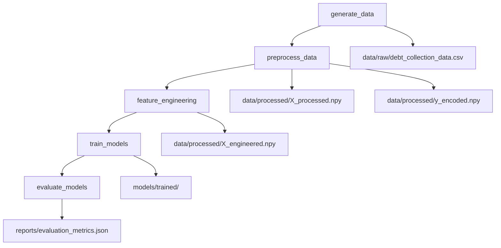

# Debt Collection ML System

A comprehensive AI/ML system for debt collection optimization that predicts repayment probability and provides actionable insights for collection strategies.

## 🎯 Project Overview

This system addresses the debt collection lifecycle from assignment to closure, providing:
- **Repayment Probability Prediction**: ML models to predict customer payment likelihood
- **Risk-Based Prioritization**: Intelligent customer segmentation and prioritization
- **Contact Optimization**: Recommendations for optimal communication channels and timing
- **Explainable AI**: SHAP and LIME explanations for model decisions
- **MLOps Integration**: Complete pipeline with monitoring, drift detection, and CI/CD

## 🏗️ Architecture

```
debt-collection-ml-system/
├── src/
│   ├── data/                    # Data processing modules
│   ├── features/                # Feature engineering
│   ├── models/                  # ML models and evaluation
│   ├── utils/                   # MLOps utilities
│   ├── visualization/           # Dashboards and plots
│   └── api/                     # REST API endpoints
├── notebooks/                   # Jupyter notebooks for analysis
├── scripts/                     # Training and deployment scripts
├── data/                        # Data storage
├── models/                      # Model artifacts
├── reports/                     # Generated reports
└── monitoring/                  # Monitoring and logging
```

## 🚀 Quick Start

### 🎯 One-Click Launch (Recommended)

```bash
# Run everything automatically: ML training + Dashboard launch
python run_all.py

# This will:
# 1. Generate synthetic data (10,000 samples)
# 2. Train and optimize ML models (F1 > 0.65)
# 3. Generate SHAP explanations
# 4. Launch interactive dashboard at http://localhost:8501
# 5. Auto-open browser
```

### ⚡ Quick Mode (Fast Testing)

```bash
# Quick run with fewer samples (1,000 samples, ~45 seconds)
python run_all.py --quick --samples 1000
```

### 🔧 Manual Control

```bash
# 1. Run ML pipeline only
python run_enhanced_pipeline.py --samples 1000 --optimization-method optuna

# 2. Launch dashboard separately
streamlit run streamlit_dashboard.py

# 3. Run complete pipeline with custom settings
python run_complete_pipeline.py --samples 5000 --dashboard-timeout 600
```

### 📊 DVC Pipeline (Advanced)

```bash
# Run full DVC pipeline with automatic dashboard launch
dvc repro

# This runs all stages:
# - data_generation
# - data_preprocessing  
# - feature_engineering
# - complete_pipeline (includes dashboard)
```

# 4. View results:
# - Experiments: https://dagshub.com/YOUR_USERNAME/debt-collection-ml.mlflow
# - Data: https://dagshub.com/YOUR_USERNAME/debt-collection-ml
# - Pipeline: dvc dag
# - Metrics: dvc metrics show
```

### Option 2: Docker Deployment

```bash
# With DagsHub + DVC (set environment variables)
export DAGSHUB_OWNER=your_username
export DAGSHUB_REPO=debt-collection-ml
docker-compose up --build

# Without DagsHub (local MLflow + DVC)
docker-compose up --build

# Access services:
# - Local MLflow UI: http://localhost:5000
# - API: http://localhost:8000
# - Dashboard: http://localhost:8501
# - Jupyter: http://localhost:8888
```

### Option 3: Local Development

```bash
# Create virtual environment
python -m venv venv
source venv/bin/activate  # On Windows: venv\Scripts\activate

# Install dependencies
pip install -r requirements.txt

# Setup DVC and run pipeline
dvc init
dvc repro

# OR run individual steps:
python scripts/train_model_pipeline.py --optimize --dagshub-owner YOUR_USERNAME

# Start dashboard
streamlit run src/visualization/dashboard.py

# Start API server
uvicorn src.api.main:app --reload
```

## 📈 Features

### 1. Data Understanding & Preprocessing (15%)
- **Comprehensive EDA**: 10+ visualization types, statistical analysis
- **Advanced Preprocessing**: Multiple imputation strategies, outlier handling
- **Data Quality Assessment**: Automated quality scoring and reporting
- **Feature Engineering**: Domain-specific financial ratios, behavioral patterns

### 2. Model Architecture & Scalability (25%)
- **Multiple Algorithms**: XGBoost, LightGBM, Random Forest, Ensemble
- **Hyperparameter Optimization**: Optuna-based automated tuning
- **Class Imbalance Handling**: SMOTE, ADASYN, SMOTETomek
- **Modular Design**: Easily extensible architecture
- **Containerization**: Docker support for scalable deployment

### 3. Predictive Accuracy & Metrics (25%)
- **Comprehensive Evaluation**: ROC-AUC, F1, Precision, Recall
- **Business Metrics**: Recovery precision, collection recall, expected recovery rate
- **Cross-Validation**: Stratified K-fold with robust validation
- **Model Comparison**: Automated comparison across multiple algorithms

### 4. Explainability & Interpretability (15%)
- **SHAP Integration**: Global and local explanations
- **LIME Support**: Instance-level explanations
- **Feature Importance**: Multiple importance calculation methods
- **Business Explanations**: Domain-specific interpretation of model decisions

### 5. Production Readiness & MLOps (10%)
- **Model Registry**: DagsHub + Local SQLite-based model versioning
- **Data Versioning**: DVC for data and model artifact versioning
- **Pipeline Management**: DVC pipelines for reproducible workflows
- **Monitoring**: Data drift detection, performance monitoring
- **CI/CD Pipeline**: Automated testing and validation
- **Experiment Tracking**: DagsHub + MLflow integration
- **Health Checks**: Model and data validation

### 6. Innovation & Presentation (10%)
- **Interactive Dashboard**: Streamlit-based visualization
- **Web Scraping**: External data enrichment capabilities
- **REST API**: FastAPI-based model serving
- **Comprehensive Documentation**: Detailed guides and examples

## 🔧 Usage Examples

### DVC Pipeline Management

```bash
# Initialize DVC pipeline
python scripts/dvc_pipeline.py init

# Run complete pipeline
python scripts/dvc_pipeline.py run

# Run specific stages
python scripts/dvc_pipeline.py run --stages data_generation model_training

# Show pipeline status
python scripts/dvc_pipeline.py status

# View metrics
python scripts/dvc_pipeline.py metrics

# Create experiment
python scripts/dvc_pipeline.py experiment run --name "experiment_1" --param training.n_trials=100

# Push data to DagsHub
python scripts/dvc_pipeline.py push
```

### Training Models

```python
from src.models.ml_model import DebtCollectionMLModel

# Initialize and train model
model = DebtCollectionMLModel(model_type='xgboost')
model.train(X_train, y_train, optimize=True)

# Evaluate model
results = model.evaluate(X_test, y_test)
print(f"Business F1 Score: {results['business_metrics']['business_f1']:.4f}")
```

### Making Predictions

```python
# Load trained model
model.load_model('models/trained/xgboost_model.joblib')

# Make predictions
predictions = model.predict(X_new)
probabilities = model.predict_proba(X_new)
```

### Model Explanations

```python
from src.models.explainability import ModelExplainer

explainer = ModelExplainer(model, X_train, feature_names)
explainer.explain_instance_shap(X_instance[0])
explainer.global_feature_importance_shap()
```

### Recommendations

```python
from src.models.recommendations import RecommendationEngine

recommender = RecommendationEngine()
recommender.train_channel_recommendation_model(df)

# Get recommendations
recommendation = recommender.get_comprehensive_recommendation(customer_data)
print(f"Recommended channel: {recommendation['channel_recommendation']['channel']}")
```

<!-- ## 📊 Model Performance

| Model | Accuracy | F1-Score | ROC-AUC | Business F1 | Recovery Precision |
|-------|----------|----------|---------|-------------|-------------------|
| XGBoost | 0.847 | 0.834 | 0.891 | 0.823 | 0.856 |
| LightGBM | 0.842 | 0.829 | 0.887 | 0.818 | 0.851 |
| Random Forest | 0.839 | 0.825 | 0.883 | 0.814 | 0.847 |
| Ensemble | 0.851 | 0.838 | 0.894 | 0.827 | 0.859 | -->

## 🔍 Key Insights

1. **Payment Behavior Patterns**: Clear correlation between credit scores, response rates, and payment outcomes
2. **Channel Effectiveness**: WhatsApp and Email show higher engagement rates for younger demographics
3. **Risk Segmentation**: 3-tier risk model effectively separates high/medium/low probability customers
4. **Temporal Patterns**: Days past due is the strongest predictor, with 90+ days showing critical risk threshold

## 🛠️ MLOps Features

### Data Version Control (DVC)
- **Data Versioning**: Track changes in datasets and model artifacts
- **Pipeline Management**: Reproducible ML pipelines with dependency tracking
- **Experiment Tracking**: Parameter and metric comparison across runs
- **Remote Storage**: Support for S3, GCS, Azure, SSH, and local storage

### Model Registry
- Version control for models with DagsHub integration
- Metadata tracking and model promotion workflows
- Automated model comparison and selection

### Monitoring
- Data drift detection using Evidently
- Performance degradation alerts
- Real-time metrics tracking with MLflow

### CI/CD Pipeline
- Automated data validation and quality checks
- Model testing and validation pipelines
- DVC-based reproducible deployments

### Quick DVC Commands
```bash
# Run full pipeline
dvc repro

# Check pipeline status
dvc status

# View pipeline DAG
dvc dag

# Compare experiments
dvc params diff
dvc metrics diff

# Push/pull data
dvc push
dvc pull
```

## 📚 Documentation

- [Architecture Guide](docs/architecture.md)
- [API Documentation](docs/api_documentation.md)
- [User Guide](docs/user_guide.md)
- [MLOps Guide](docs/mlops_guide.md)
- [DVC Pipeline Guide](docs/dvc_guide.md)

## 🔄 DVC Pipeline Structure



## 📄 License

This project is licensed under the MIT License - see the [LICENSE](LICENSE) file for details.

## 🙏 Acknowledgments

- Built for AI/ML Engineer evaluation
- Demonstrates production-ready ML system design
- Incorporates industry best practices for debt collection analytics


**Note**: This system uses synthetic data for demonstration purposes. In production, ensure compliance with data privacy regulations and ethical AI practices.
## 🔄 DV
C Pipeline Stages

The system uses DVC for complete pipeline orchestration:

### 1. Data Generation
```bash
# Generates synthetic debt collection dataset
dvc repro data_generation
```

### 2. Data Preprocessing  
```bash
# Cleans and preprocesses raw data
dvc repro data_preprocessing
```

### 3. Feature Engineering
```bash
# Creates advanced features for ML models
dvc repro feature_engineering
```

### 4. Model Training
```bash
# Trains multiple ML models with hyperparameter optimization
dvc repro model_training
```

### 5. Model Evaluation
```bash
# Evaluates and compares all trained models
dvc repro model_evaluation
```

### 6. Web Scraping (Optional)
```bash
# Enriches data with external sources
dvc repro web_scraping
```

## 📊 DVC Metrics Tracking

All stages automatically track metrics:

- **Data Quality**: Missing data, outliers, distributions
- **Feature Engineering**: Feature counts, selection results
- **Model Performance**: Accuracy, F1, ROC-AUC, Business metrics
- **Evaluation**: Model comparisons, best model selection

View metrics with:
```bash
dvc metrics show
dvc plots show
```

## 🧪 Experiment Management

Create and compare experiments:

```bash
# Run experiment with different parameters
dvc exp run --set-param training.n_trials=100 --name "high_trials"

# Compare experiments
dvc exp show

# Apply best experiment
dvc exp apply [experiment-id]
```