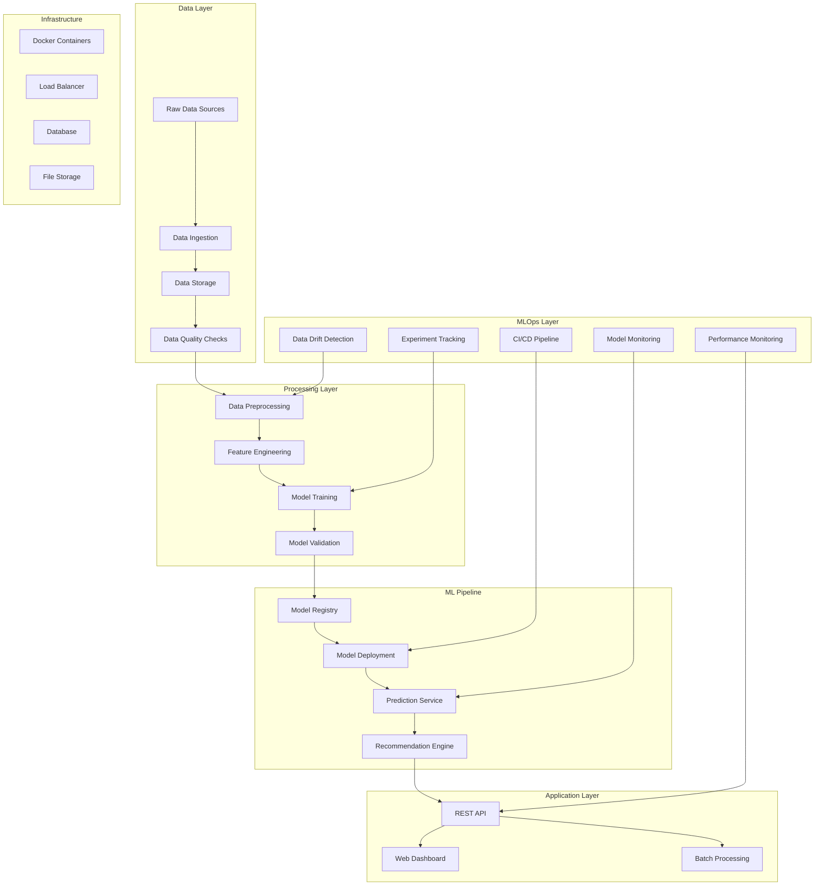
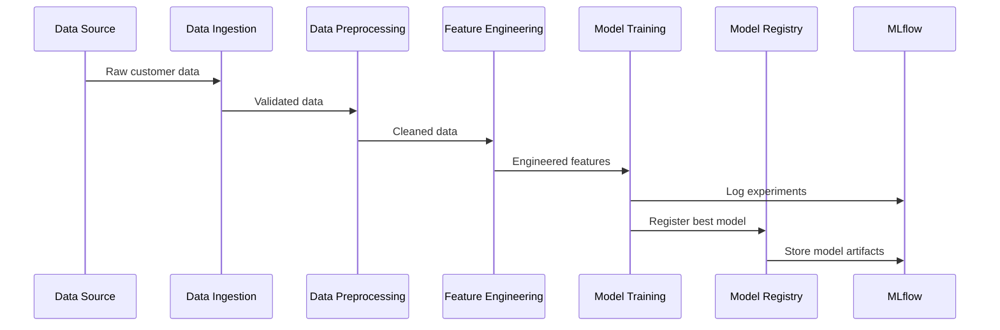
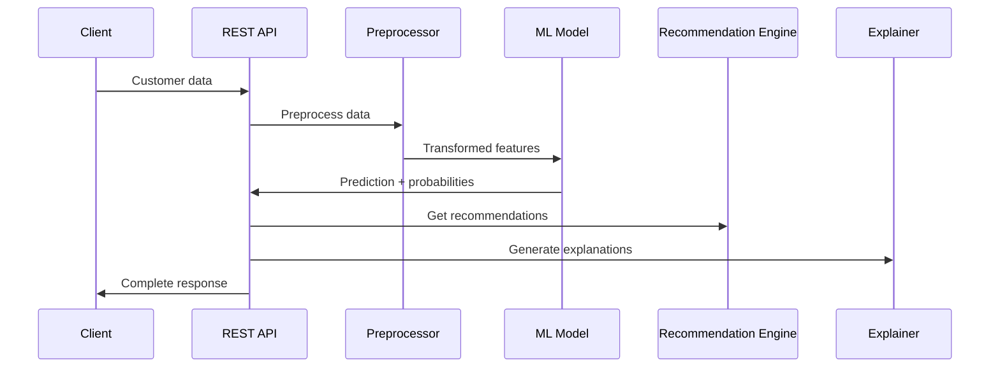
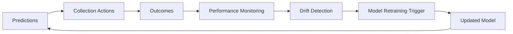

# Debt Collection ML System - Technical Architecture

## 1. System Overview

The Debt Collection ML System is a comprehensive, production-ready machine learning platform designed to optimize debt collection processes through predictive analytics, intelligent recommendations, and explainable AI.

### 1.1 Architecture Principles

- **Modularity**: Clean separation of concerns with independent, reusable components
- **Scalability**: Containerized architecture supporting horizontal scaling
- **Maintainability**: Well-documented, tested code with clear interfaces
- **Observability**: Comprehensive logging, monitoring, and alerting
- **Security**: Secure API endpoints with proper authentication and validation

## 2. End-to-End System Design



## 3. Component Architecture

### 3.1 Data Ingestion Pipeline

```python
# Data flow: Raw Data → Validation → Preprocessing → Feature Engineering → Model Ready Data

Raw Customer Data
    ↓
Data Quality Assessment
    ↓
Missing Value Imputation
    ↓
Outlier Detection & Handling
    ↓
Feature Engineering
    ↓
Feature Selection
    ↓
Model-Ready Dataset
```

**Components:**
- `DebtCollectionDataGenerator`: Synthetic data generation for development/testing
- `DataQualityChecker`: Automated data quality assessment and scoring
- `AdvancedDataPreprocessor`: Comprehensive preprocessing pipeline
- `AdvancedFeatureEngineer`: Domain-specific feature engineering

### 3.2 Model Training Architecture

```python
# Multi-model training with automated hyperparameter optimization

Training Data
    ↓
Cross-Validation Setup
    ↓
Hyperparameter Optimization (Optuna)
    ↓
Model Training (XGBoost, LightGBM, RF, Ensemble)
    ↓
Model Evaluation & Comparison
    ↓
Best Model Selection
    ↓
Model Registry
```

**Components:**
- `DebtCollectionMLModel`: Core ML model with multiple algorithm support
- `ModelEvaluator`: Comprehensive evaluation with business metrics
- `ModelComparison`: Automated model comparison framework
- `MLOpsOrchestrator`: End-to-end MLOps workflow management

### 3.3 Prediction & Recommendation Architecture

```python
# Real-time prediction and recommendation pipeline

Customer Data
    ↓
Data Preprocessing
    ↓
Feature Engineering
    ↓
Model Prediction
    ↓
Risk Assessment
    ↓
Recommendation Generation
    ↓
Explanation Generation (SHAP/LIME)
    ↓
Response Formatting
```

**Components:**
- `ModelExplainer`: SHAP and LIME-based model explanations
- `RecommendationEngine`: Intelligent contact strategy recommendations
- `FastAPI Application`: REST API for real-time predictions

## 4. Data Flow Architecture

### 4.1 Training Data Flow



### 4.2 Prediction Data Flow



### 4.3 Feedback Loop Architecture



## 5. MLOps Integration

### 5.1 Model Lifecycle Management

```python
# Complete model lifecycle with versioning and deployment

Development → Staging → Production
    ↓           ↓          ↓
Model v1.0  Model v1.1  Model v1.0 (stable)
    ↓           ↓          ↓
Testing     Validation  Monitoring
    ↓           ↓          ↓
Approval    Promotion   Feedback
```

**Components:**
- `ModelRegistry`: Local SQLite-based model versioning
- `DataDriftMonitor`: Evidently-based drift detection
- `ModelPerformanceMonitor`: Performance tracking and alerting
- `ContinuousIntegration`: Automated testing and validation

### 5.2 Monitoring & Observability

```python
# Multi-layer monitoring approach

Application Metrics
    ↓
Model Performance Metrics
    ↓
Data Quality Metrics
    ↓
Infrastructure Metrics
    ↓
Business Metrics
```

**Monitoring Stack:**
- **Application**: FastAPI metrics, response times, error rates
- **Model**: Accuracy, drift, feature importance changes
- **Data**: Quality scores, distribution changes, missing data
- **Business**: Collection success rates, ROI, customer satisfaction

## 6. Scalability Architecture

### 6.1 Horizontal Scaling

```yaml
# Docker Compose scaling configuration

services:
  ml-api:
    replicas: 3
    deploy:
      resources:
        limits:
          cpus: '2'
          memory: 4G
  
  dashboard:
    replicas: 2
    
  monitoring:
    replicas: 1
```

### 6.2 Load Balancing

```python
# API load balancing strategy

Client Request
    ↓
Load Balancer (nginx/HAProxy)
    ↓
API Instance Pool
    ↓
Shared Model Storage
    ↓
Response Aggregation
```

## 7. Security Architecture

### 7.1 API Security

```python
# Multi-layer security approach

API Gateway
    ↓
Authentication (JWT/OAuth)
    ↓
Authorization (RBAC)
    ↓
Input Validation
    ↓
Rate Limiting
    ↓
Audit Logging
```

### 7.2 Data Security

- **Encryption**: Data at rest and in transit
- **Access Control**: Role-based access to sensitive data
- **Audit Trail**: Complete logging of data access and modifications
- **Privacy**: PII anonymization and GDPR compliance

## 8. Deployment Architecture

### 8.1 Container Architecture

```dockerfile
# Multi-stage Docker build for optimization

FROM python:3.9-slim as base
# Install dependencies

FROM base as development
# Development tools and debugging

FROM base as production
# Optimized for production deployment
```

### 8.2 Service Architecture

```yaml
# Microservices deployment

Services:
  - ml-api: Core prediction service
  - dashboard: Web interface
  - monitoring: Health and performance monitoring
  - mlflow: Experiment tracking
  - jupyter: Development environment
```

## 9. Performance Characteristics

### 9.1 Latency Requirements

- **Single Prediction**: < 100ms
- **Batch Prediction (100 records)**: < 2 seconds
- **Dashboard Load**: < 3 seconds
- **Model Training**: < 30 minutes

### 9.2 Throughput Capacity

- **API Requests**: 1000 requests/second
- **Concurrent Users**: 100 dashboard users
- **Batch Processing**: 10,000 records/minute
- **Model Updates**: Daily retraining capability

## 10. Technology Stack

### 10.1 Core Technologies

- **Language**: Python 3.9+
- **ML Framework**: scikit-learn, XGBoost, LightGBM
- **Web Framework**: FastAPI, Streamlit
- **Data Processing**: pandas, numpy
- **Visualization**: Plotly, matplotlib, seaborn

### 10.2 MLOps Stack

- **Experiment Tracking**: MLflow
- **Model Registry**: Custom SQLite-based registry
- **Monitoring**: Evidently, custom metrics
- **Containerization**: Docker, Docker Compose
- **CI/CD**: Custom Python-based pipeline

### 10.3 Infrastructure

- **Database**: SQLite (development), PostgreSQL (production)
- **Storage**: Local filesystem, S3-compatible storage
- **Caching**: Redis (optional)
- **Logging**: Python logging, structured logs

## 11. Development Workflow

### 11.1 Feature Development

```python
# Development workflow

Feature Request
    ↓
Requirements Analysis
    ↓
Data Exploration (Jupyter)
    ↓
Feature Implementation
    ↓
Unit Testing
    ↓
Integration Testing
    ↓
Code Review
    ↓
Deployment
```

### 11.2 Model Development

```python
# Model development lifecycle

Business Problem
    ↓
Data Analysis (EDA)
    ↓
Feature Engineering
    ↓
Model Experimentation
    ↓
Model Validation
    ↓
Performance Testing
    ↓
Production Deployment
    ↓
Monitoring & Feedback
```

## 12. Future Enhancements

### 12.1 Planned Features

- **Real-time Streaming**: Kafka-based real-time data processing
- **Advanced ML**: Deep learning models, AutoML integration
- **Cloud Deployment**: AWS/GCP/Azure deployment options
- **Advanced Monitoring**: Prometheus/Grafana integration
- **A/B Testing**: Built-in experimentation framework

### 12.2 Scalability Roadmap

- **Microservices**: Break down into smaller, focused services
- **Event-Driven**: Implement event-driven architecture
- **Multi-tenant**: Support for multiple organizations
- **Global Deployment**: Multi-region deployment capability

This architecture provides a solid foundation for a production-ready debt collection ML system that can scale with business needs while maintaining high performance and reliability.